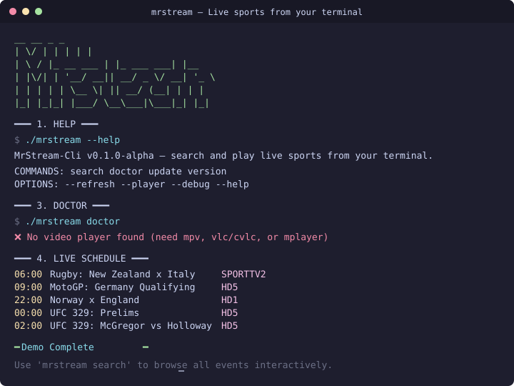

<p align="center">
<br>
<a href="http://makeapullrequest.com"></a>
<a href="#Linux"></a>
<a href="#MacOS"></a>
<a href="#Android"></a>
<a href="#Windows"></a>
<br>
<h1 align="center">
<a href="https://github.com/Prarambha369"></a>
<a href="https://github.com/Prarambha369/mrstream-cli"></a>
</h1>
<p align="center">
  <sub>MrStream-Cli is a terminal-based sports event browser and stream launcher built with POSIX shell scripts. It provides a fast, ethical way to find and watch live sports streams directly from your terminal.</sub>
</p>

<h3 align="center">
A minimalist, terminal-native sports event browser and stream launcher. 📡
</h3>

> ⚠️ **IMPORTANT**: MrStream-Cli is NOT affiliated with sportsonline.vc, sportssonline.click, or any content provider. Use at your own risk.

<h1 align="center">
	Showcase
</h1>

<p align="center">
  
</p>

<details><summary><b>📺 Replay or Record Your Own Demo</b></summary>

Replay the recorded demo session:
```sh
scriptreplay .assets/demo.typescript
```

Record a fresh demo:
```sh
script -q -c "sh scripts/demo.sh" .assets/demo.typescript
```

Generate a .webm recording (requires `asciinema` + `svg-term`):
```sh
asciinema rec .assets/demo.cast -c "sh scripts/demo.sh"
npx svg-term --in .assets/demo.cast --out .assets/demo.svg --window
```

</details>

## Table of Contents

- [Features](#features)
- [Prerequisites](#prerequisites)
- [Installation](#installation)
  - [Tier 1: Linux, Mac, Android](#tier-1-support-linux-mac-android)
  - [Tier 2: Windows, WSL, iOS, Steam Deck](#tier-2-support-windows-wsl-ios-steam-deck)
  - [Source Install](#installing-from-source-universal)
  - [Uninstall](#uninstall)
- [Usage](#usage)
  - [Basic Search](#basic-search)
  - [Advanced Options](#advanced-options)
  - [Troubleshooting](#troubleshooting)
- [Configuration](#configuration)
- [License](#license)

## Features

- **POSIX-compliant**: Lightweight shell scripts with minimal dependencies.
- **Fast Search**: Instant search through sports schedules using `fzf`.
- **Integrated Playback**: Seamlessly hands over streams to `mpv`.
- **Cached Results**: Local caching to reduce network load and improve speed.
- **Ethical Design**: Requires explicit user consent for third-party sources.

## Prerequisites

Ensure you have the following installed:

| Dependency | Purpose |
|------------|---------|
| `curl` | For fetching data |
| `fzf` | For the interactive search menu |
| `mpv` | For stream playback |
| `grep`, `sed` | Standard Unix utilities |

<details><summary><b>Install Dependencies</b></summary>

#### Debian/Ubuntu
```sh
sudo apt install curl fzf mpv grep sed
```

#### Fedora
```sh
sudo dnf install curl fzf mpv grep sed
```

#### Arch Linux
```sh
sudo pacman -S curl fzf mpv grep sed
```

#### macOS (Homebrew)
```sh
brew install curl fzf mpv grep sed
```

#### Android (Termux)
```sh
pkg install curl fzf mpv grep sed
```

</details>

## Installation

[](https://repology.org/project/mrstream-cli/versions)

### Tier 1 Support: Linux, Mac, Android

*These platforms have rock-solid support and are actively tested by maintainers.*

<details><summary><b>Linux</b></summary>

#### Native Packages

*Native packages offer robust update cycles. If available for your distro, we recommend using them.*

<details><summary>Debian/Ubuntu</summary>

```sh
# Add repository (when available)
# sudo add-apt-repository ppa:prarambha369/mrstream-cli
# sudo apt update
# sudo apt install mrstream-cli

# Or install via automatic script:
curl -fsSL https://raw.githubusercontent.com/Prarambha369/mrstream-cli/main/scripts/install.sh | bash
```
</details>

<details><summary>Fedora</summary>

```sh
# COPR repo (when available)
# sudo dnf copr enable prarambha369/mrstream-cli
# sudo dnf install mrstream-cli

# Or install manually:
curl -fsSL https://raw.githubusercontent.com/Prarambha369/mrstream-cli/main/scripts/install.sh | bash
```
</details>

<details><summary>Arch Linux</summary>

```sh
# AUR package (when available)
# yay -S mrstream-cli

# Or install from source:
git clone https://github.com/Prarambha369/mrstream-cli.git
cd mrstream-cli
ln -s "$(pwd)/mrstream" ~/.local/bin/mrstream
```
</details>

<details><summary>OpenSUSE</summary>

```sh
# Install dependencies first:
sudo zypper install curl fzf mpv grep sed

# Then install via script:
curl -fsSL https://raw.githubusercontent.com/Prarambha369/mrstream-cli/main/scripts/install.sh | bash
```
</details>

</details>

<details><summary><b>macOS</b></summary>

Install dependencies via Homebrew:

```sh
brew install curl fzf mpv grep sed
```

Then install MrStream-Cli:

```sh
# Automatic (recommended)
curl -fsSL https://raw.githubusercontent.com/Prarambha369/mrstream-cli/main/scripts/install.sh | bash

# Or manual:
git clone https://github.com/Prarambha369/mrstream-cli.git
cd mrstream-cli
ln -s "$(pwd)/mrstream" "$(brew --prefix)/bin/mrstream"
```

> 💡 **Note**: On Apple Silicon, ensure `mpv` is installed via Homebrew for optimal M1/M2/M3 support.

</details>

<details><summary><b>Android (Termux)</b></summary>

1. Install [Termux](https://termux.com/) from F-Droid (recommended) or Play Store.

2. Update packages and install dependencies:
```sh
pkg update -y
pkg install curl fzf mpv grep sed
```

3. Install MrStream-Cli:
```sh
# Automatic
curl -fsSL https://raw.githubusercontent.com/Prarambha369/mrstream-cli/main/scripts/install.sh | bash

# Or manual
git clone https://github.com/Prarambha369/mrstream-cli.git
cd mrstream-cli
ln -s "$(pwd)/mrstream" "$PREFIX/bin/mrstream"
```

> ⚠️ **Android 14+**: If you encounter permission issues, run:
> ```sh
> pkg install termux-am
> ```

</details>

---

### Tier 2 Support: Windows, WSL, iOS, Steam Deck

*Installation is possible but may require additional configuration. Reach out via [Issues](https://github.com/Prarambha369/mrstream-cli/issues) if you need assistance.*

<details><summary><b>Windows (Git Bash)</b></summary>

MrStream-Cli works best in a POSIX-compatible shell. We recommend **Git Bash** with **Windows Terminal**.

#### Setup Steps:

1. Install [Git for Windows](https://gitforwindows.org/) (includes Git Bash).

2. Install [Windows Terminal](https://aka.ms/terminal) (preinstalled on Windows 11).

3. Configure Windows Terminal to use Git Bash:
   - Open Settings → Profiles → Add new profile
   - Name: `Git Bash`
   - Command line: `%GIT_INSTALL_ROOT%\bin\bash.exe -i -l`
   - Icon: `%GIT_INSTALL_ROOT%\mingw64\share\git\git-for-windows.ico`
   - Starting directory: `%USERPROFILE%`

4. In Git Bash, install dependencies via [Scoop](https://scoop.sh/):
```sh
# Install Scoop first if needed:
iwr -useb get.scoop.sh | iex

# Then install dependencies:
scoop install curl fzf mpv grep sed
```

5. Install MrStream-Cli:
```sh
curl -fsSL https://raw.githubusercontent.com/Prarambha369/mrstream-cli/main/scripts/install.sh | bash
```

#### Known Issues:
- ❌ `fzf` may not render correctly in `mintty` (default Git Bash terminal). **Solution**: Use Windows Terminal + Git Bash profile as configured above.
- ❌ Paths with spaces may cause issues. **Solution**: Use short paths or quote arguments.
- ❌ `mpv` configuration reads from `C:\Users\USERNAME\scoop\apps\mpv\current\portable_config`.

</details>

<details><summary><b>WSL (Windows Subsystem for Linux)</b></summary>

1. Install your preferred Linux distribution via WSL ([Guide](https://learn.microsoft.com/en-us/windows/wsl/install)).

2. Follow the **Linux installation instructions** above for your distro.

3. **Important**: Install `mpv` on **Windows**, not WSL, for proper display server access:
```powershell
# In PowerShell (Windows):
scoop install mpv
# Or download from: https://mpv.io/installation/
```

4. Ensure `mpv.exe` is in your Windows `PATH` so WSL can invoke it.

> ℹ️ **Why?**: WSL1 lacks GUI support; WSL2 requires WSLg. Using Windows-native `mpv` ensures consistent playback.

</details>

<details><summary><b>iOS (iSH)</b></summary>

1. Install [iSH](https://ish.app/) from the App Store.

2. Update APK and install dependencies:
```sh
apk update && apk upgrade
apk add curl fzf mpv grep sed git
```

3. Install MrStream-Cli:
```sh
git clone --depth 1 https://github.com/Prarambha369/mrstream-cli.git ~/.mrstream-cli
cp ~/.mrstream-cli/mrstream /usr/local/bin/mrstream
chmod +x /usr/local/bin/mrstream
rm -rf ~/.mrstream-cli
```

> ⚠️ **Note**: Network operations may be slow on iSH due to emulation overhead. This is an iSH limitation, not MrStream-Cli.

</details>

<details><summary><b>Steam Deck</b></summary>

#### Quick Install Script:

1. Switch to **Desktop Mode** (`STEAM` → Power → Switch to Desktop).

2. Open **Konsole** and run:
```sh
# Create bin directory and update PATH
[ ! -d ~/.local/bin ] && mkdir -p ~/.local/bin
echo 'export PATH="$HOME/.local/bin:$PATH"' >> ~/.bashrc
source ~/.bashrc

# Install dependencies
sudo pacman -S --noconfirm curl fzf mpv grep sed git

# Install MrStream-Cli
git clone --depth 1 https://github.com/Prarambha369/mrstream-cli.git ~/.mrstream-cli
cp ~/.mrstream-cli/mrstream ~/.local/bin/mrstream
chmod +x ~/.local/bin/mrstream
rm -rf ~/.mrstream-cli
```

#### Optional: Desktop Entry for Gaming Mode
```sh
echo '[Desktop Entry]
Encoding=UTF-8
Type=Application
Exec=konsole -e mrstream search
Name=MrStream-Cli
Icon=utilities-terminal
Categories=Network;' > ~/.local/share/applications/mrstream-cli.desktop
```

Then in Steam: `Add Game` → `Add a non-Steam game` → Select `MrStream-Cli`.

</details>

---

### Installing from Source (Universal)

*Works on any Unix-like system. Baseline for porting efforts.*

```sh
# 1. Install dependencies (see platform sections above)

# 2. Clone and install:
git clone https://github.com/Prarambha369/mrstream-cli.git
cd mrstream-cli
chmod +x mrstream

# 3. Link to PATH (choose one):
# System-wide (requires sudo):
sudo cp mrstream /usr/local/bin/

# User-only (recommended):
ln -s "$(pwd)/mrstream" ~/.local/bin/mrstream
```

---

## Uninstall

<details><summary><b>Remove MrStream-Cli</b></summary>

#### Linux/macOS (manual install)
```sh
rm -f ~/.local/bin/mrstream
# Or if installed system-wide:
sudo rm -f /usr/local/bin/mrstream
```

#### Windows (Git Bash + Scoop)
```sh
scoop uninstall mrstream-cli  # if installed via scoop
# Or manual:
rm -f ~/.local/bin/mrstream
```

#### Android (Termux)
```sh
rm -f "$PREFIX/bin/mrstream"
```

#### iOS (iSH)
```sh
rm -f /usr/local/bin/mrstream
```

#### Clean config/cache (optional)
```sh
rm -rf ~/.config/mrstream
rm -rf ~/.cache/mrstream
```

</details>

## Usage

### Basic Search

Run `mrstream search` to see all available events:

```bash
mrstream search
```

Or search for a specific team or sport:

```bash
mrstream search "Liverpool"
```

### Advanced Options

| Flag | Description |
|------|-------------|
| `--refresh` | Force a refresh of the local cache |
| `--player` | Force a specific player (`mpv`, `vlc`, `mplayer`, `cvlc`) |
| `--help` | Display the help menu |

You can also set the default player with:

```bash
MRSTREAM_PLAYER=vlc mrstream search "Liverpool"
```

### Troubleshooting

Run the doctor command to check if all dependencies are correctly installed:

```bash
mrstream doctor
```

<details><summary><b>Common Issues</b></summary>

- **`fzf` not found**: Ensure `fzf` is installed and in your `$PATH`.
- **Stream won't play**: Direct playback may be blocked by the stream provider. Try `mpv`, `vlc`, or `mplayer`, or open the printed referrer URL in a browser.
- **Cache issues**: Use `mrstream search --refresh` to force a cache rebuild.

</details>

## Configuration

The configuration is stored at `~/.config/mrstream/sources.yaml`. By default, external sources are disabled for ethical reasons. You will be prompted to enable a source the first time you search, or you can manually edit the file:

```yaml
sources:
  sportsonline:
    enabled: true
    acknowledge_non_affiliation: true
```

<details><summary><b>Configuration Options</b></summary>

| Option | Default | Description |
|--------|---------|-------------|
| `sources.sportsonline.enabled` | `false` | Enable/disable the sportsonline source |
| `sources.sportsonline.acknowledge_non_affiliation` | `false` | Confirm you understand MrStream-Cli is not affiliated with content providers |

</details>

## Homies

Other excellent terminal media tools you might enjoy:

- [**ani-cli**](https://github.com/pystardust/ani-cli) — Browse and watch anime from your terminal (13k ⭐)
- [**lobster**](https://github.com/justchokingaround/lobster) — Watch movies and series from the terminal
- [**mov-cli**](https://github.com/mov-cli/mov-cli) — Watch everything from your terminal
- [**yt-dlp**](https://github.com/yt-dlp/yt-dlp) — Feature-rich video downloader
- [**mpv**](https://github.com/mpv-player/mpv) — The video player that powers mrstream
- [**fzf**](https://github.com/junegunn/fzf) — The fuzzy finder that powers the interactive menu

## License

[![License][license-shield]][license-url]

This project is licensed under the **GPL-3.0 License** - see the [LICENSE](./LICENSE) file for details.

---

<p align="center">
  <sub>Built with ❤️ by <a href="https://github.com/Prarambha369">Prarambha369</a></sub>
</p>

[//]: # (Badge references)
[stars-shield]: https://img.shields.io/github/stars/Prarambha369/mrstream-cli?style=flat
[stars-url]: https://github.com/Prarambha369/mrstream-cli/stargazers
[releases-shield]: https://img.shields.io/github/v/release/Prarambha369/mrstream-cli?style=flat
[releases-url]: https://github.com/Prarambha369/mrstream-cli/releases
[issues-shield]: https://img.shields.io/github/issues/Prarambha369/mrstream-cli?style=flat
[issues-url]: https://github.com/Prarambha369/mrstream-cli/issues
[license-shield]: https://img.shields.io/github/license/Prarambha369/mrstream-cli?style=flat
[license-url]: ./LICENSE
